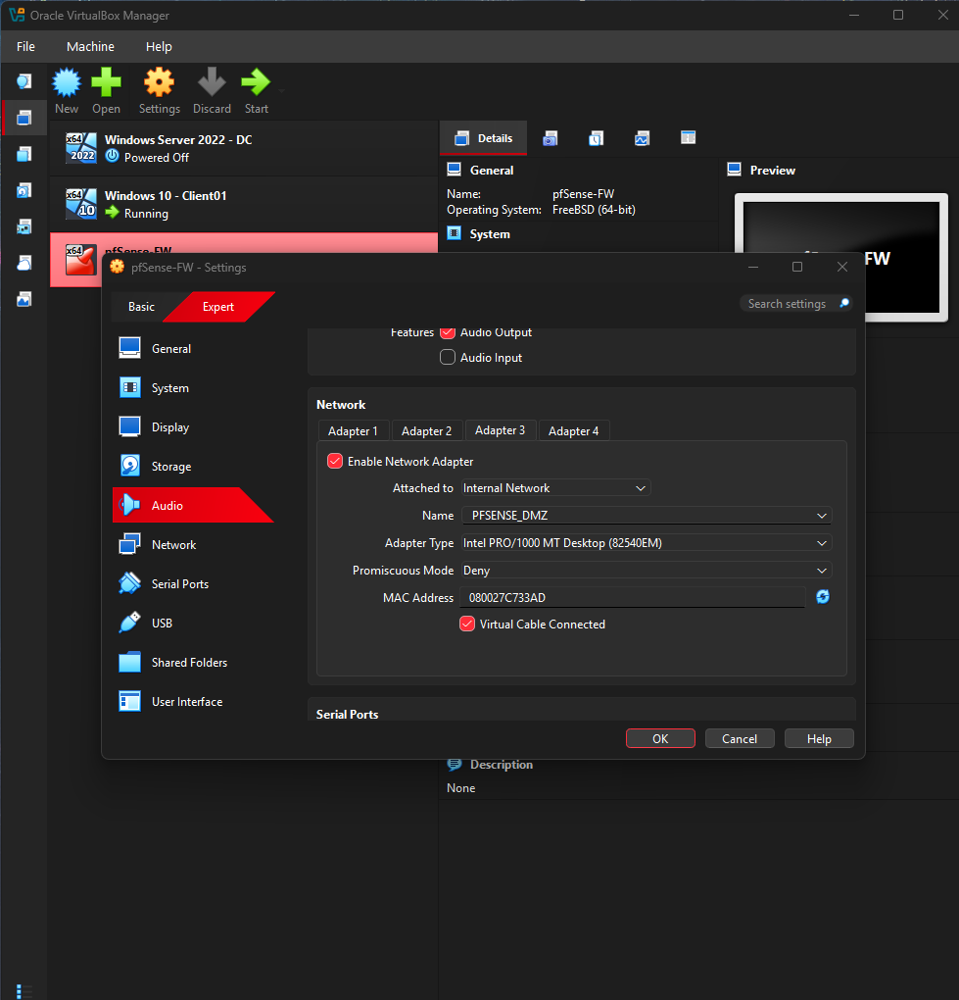
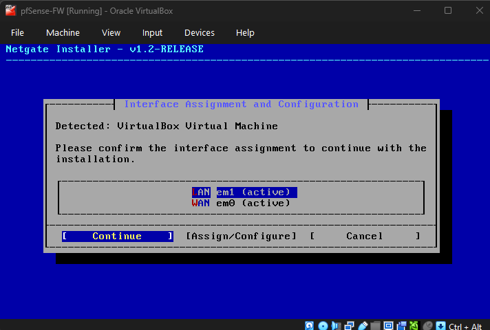

# pfSense Firewall Segmentation Home Lab

## Project Overview

This project demonstrates a virtual firewall lab built with pfSense Community Edition in Oracle VM VirtualBox. The lab uses separate LAN and DMZ networks to practice firewall routing, DHCP, network segmentation, and access control rules.

The goal was to configure pfSense as a firewall/router, place a Windows 10 client on the trusted LAN, place an Ubuntu Server VM in a DMZ network, and verify that the DMZ system could access the internet while being blocked from reaching the internal LAN.

---

## Lab Environment

- Oracle VM VirtualBox
- pfSense Community Edition 2.8.1
- Windows 10 Client VM
- Ubuntu Server DMZ-Test VM
- Windows Server 2022 DC VM/Splunk server from previous lab, used as optional future expansion

---

## Network Design

| Network | pfSense Interface | Subnet | Purpose |
|---|---|---|---|
| WAN | em0 | 10.0.2.0/24 | Internet access through VirtualBox NAT |
| LAN | em1 | 192.168.1.0/24 | Trusted internal network |
| DMZ / OPT1 | em2 | 192.168.20.0/24 | Less-trusted segmented network |

---

## VirtualBox Network Adapters

pfSense was configured with three network adapters:

| Adapter | VirtualBox Mode | pfSense Interface | Purpose |
|---|---|---|---|
| Adapter 1 | NAT | WAN / em0 | Provides internet access |
| Adapter 2 | Internal Network: PFSENSE_LAN | LAN / em1 | Trusted LAN network |
| Adapter 3 | Internal Network: PFSENSE_DMZ | OPT1 / em2 | DMZ network |




---

## Phase 1: pfSense Installation and Interface Assignment

During installation, pfSense detected the VirtualBox network interfaces and assigned them to WAN and LAN.



After installation, pfSense showed the WAN and LAN configuration from the console.


---

## Phase 2: Basic Firewall and LAN Connectivity

The Windows 10 Client VM was connected to the pfSense LAN network. It received an IP address from pfSense DHCP:

```text
Client IP Address: 192.168.1.100
Default Gateway: 192.168.1.1

The pfSense web interface was reachable from the LAN client at:

https://192.168.1.1

Internet connectivity was verified from CLIENT01 through pfSense.

Phase 3: DMZ Segmentation

A third pfSense adapter was added for a DMZ network using OPT1.

The DMZ interface was configured as:

OPT1 / DMZ IP: 192.168.20.1/24
DHCP Range: 192.168.20.100 - 192.168.20.199

An Ubuntu Server VM named DMZ-Test was connected to the PFSENSE_DMZ internal network. It received the following DHCP address:

DMZ-Test IP Address: 192.168.20.100

Firewall Rules

Two OPT1 firewall rules were created:

Order	Action	Source	Destination	Purpose
1	Block	OPT1 subnets	LAN subnets	Prevent DMZ systems from reaching internal LAN
2	Pass	OPT1 subnets	Any	Allow DMZ systems to reach the internet and other allowed destinations

Rule order matters because pfSense processes firewall rules from top to bottom.

Validation Tests

From the DMZ-Test Ubuntu VM, the following connectivity tests were performed:

ping -c 4 192.168.20.1
ping -c 4 8.8.8.8
ping -c 4 google.com
ping -c 4 192.168.1.100

Results:

Test	Result
DMZ-Test to pfSense DMZ gateway 192.168.20.1	Successful
DMZ-Test to internet IP 8.8.8.8	Successful
DMZ-Test to google.com	Successful
DMZ-Test to LAN client 192.168.1.100	Blocked

This confirms that the DMZ host can access the internet but cannot reach the trusted LAN.

Skills Demonstrated
pfSense firewall installation and configuration
VirtualBox internal networking
WAN, LAN, and DMZ interface assignment
DHCP configuration
Firewall rule creation and ordering
Network segmentation
Connectivity testing with ipconfig, ip addr, and ping
Basic firewall validation and documentation
Future Improvements
Forward pfSense firewall logs to Splunk using syslog
Create Splunk searches for blocked DMZ-to-LAN traffic
Add firewall log screenshots and alerting examples
Add a dedicated web server in the DMZ
Add more granular rules, such as allowing only DNS, HTTP, and HTTPS from the DMZ
