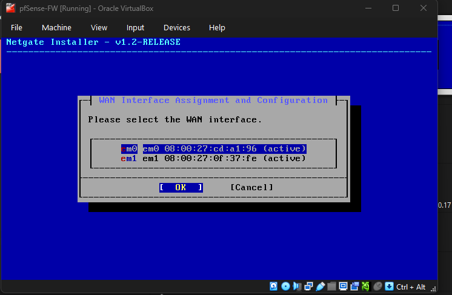
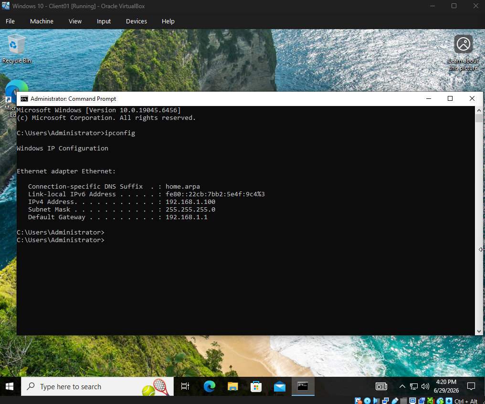
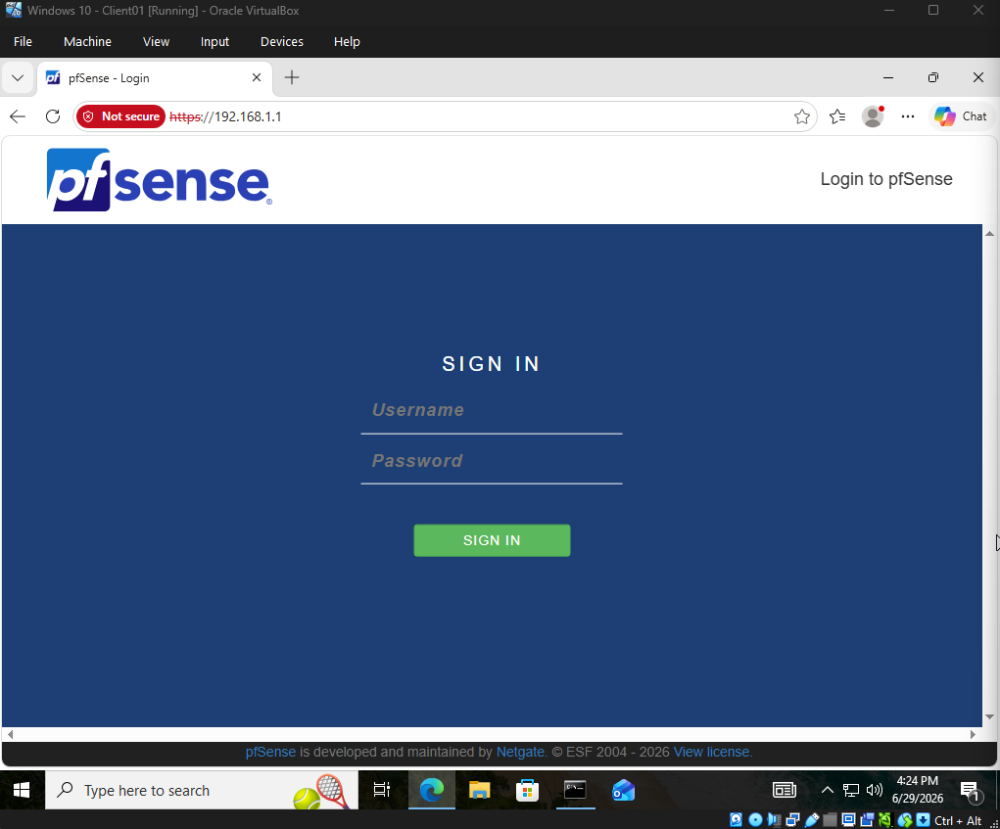
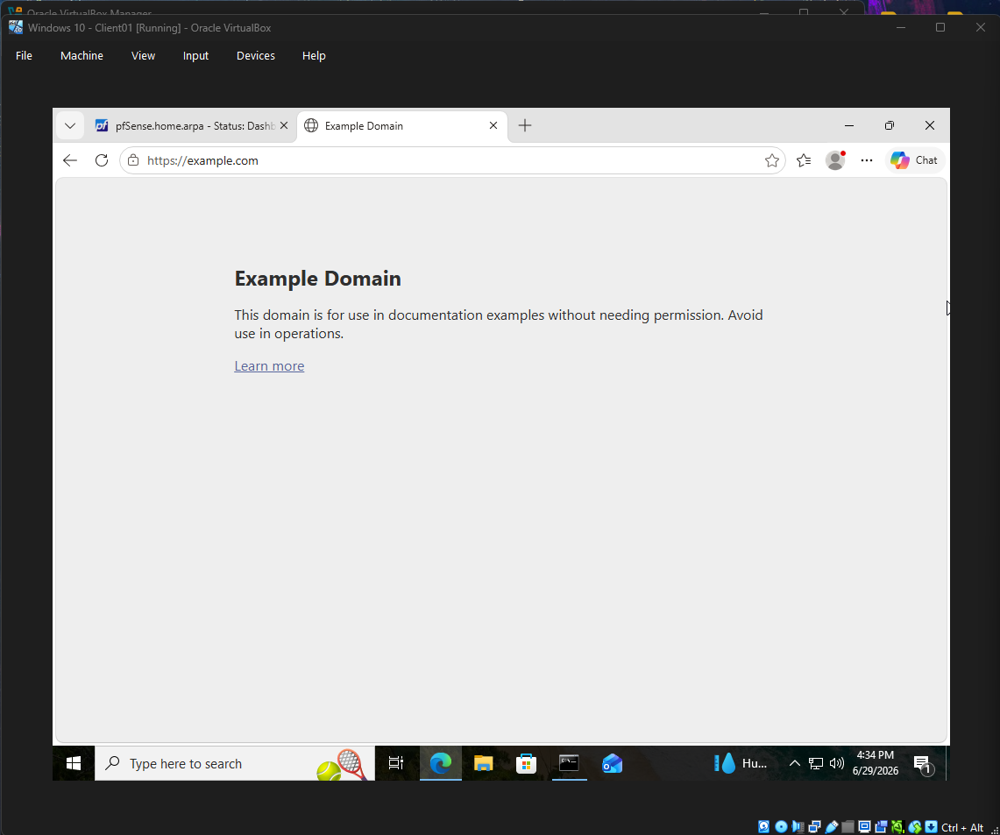
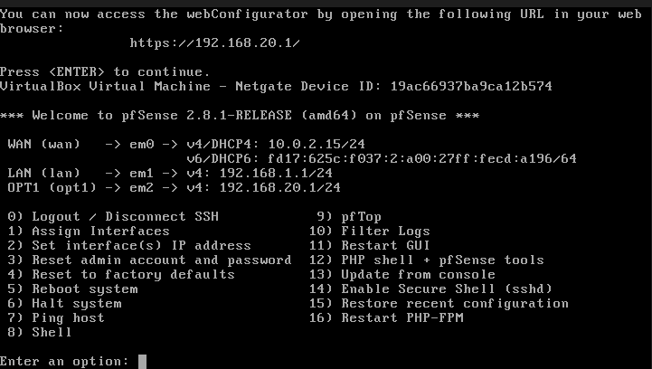
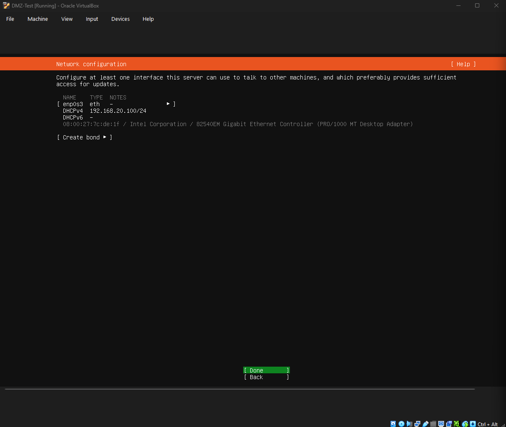
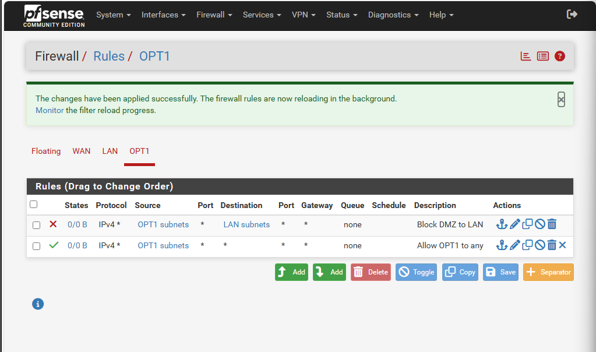
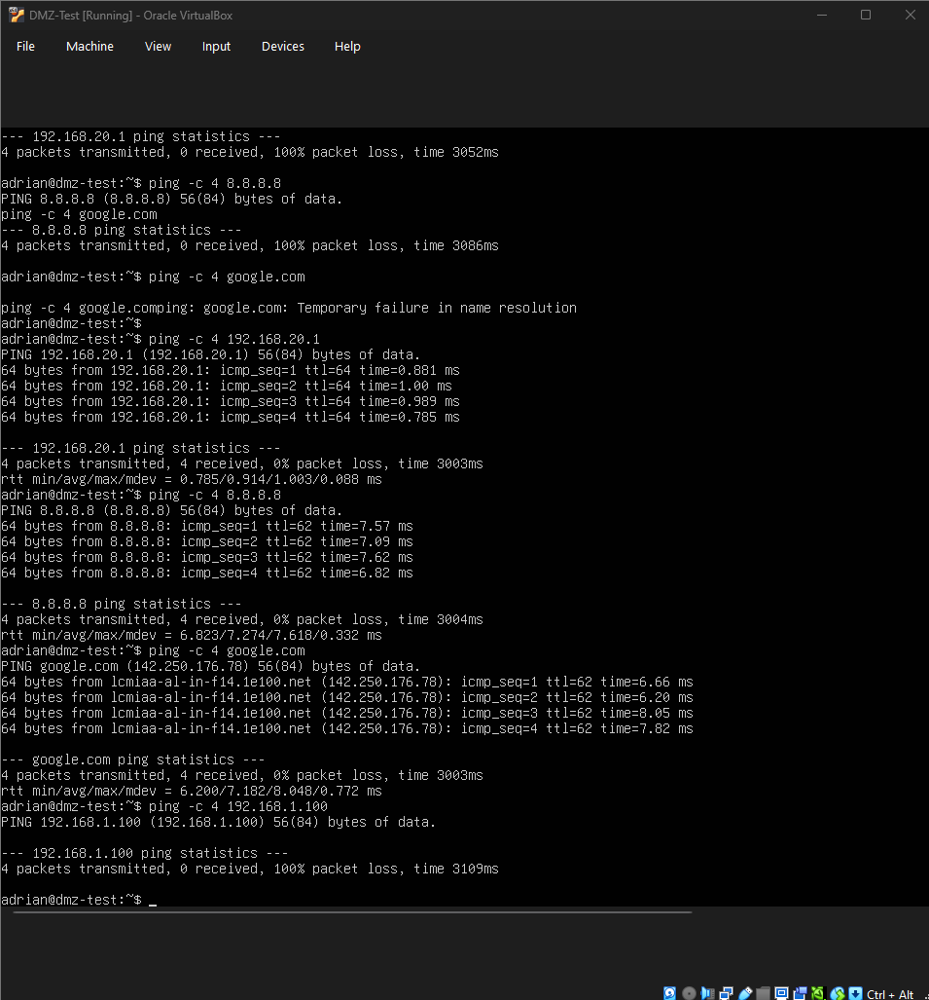

# pfSense Firewall Segmentation Home Lab

## Project Overview

This project demonstrates a virtual firewall lab built with pfSense Community Edition in Oracle VM VirtualBox. The lab uses separate WAN, LAN, and DMZ networks to practice firewall routing, DHCP, network segmentation, and access control rules.

The goal was to configure pfSense as the main firewall/router, place a Windows 10 client on the trusted LAN, place an Ubuntu Server VM in a segmented DMZ network, and verify that the DMZ system could access the internet while being blocked from reaching the internal LAN.

---

## Lab Environment

- Oracle VM VirtualBox
- pfSense Community Edition 2.8.1
- Windows 10 Client VM
- Ubuntu Server DMZ-Test VM
- Windows Server 2022 DC VM from a previous lab, used as optional future expansion

---

## Network Design

| Network | pfSense Interface | Subnet | Purpose |
|---|---|---|---|
| WAN | em0 | 10.0.2.0/24 | Internet access through VirtualBox NAT |
| LAN | em1 | 192.168.1.0/24 | Trusted internal network |
| DMZ / OPT1 | em2 | 192.168.20.0/24 | Segmented less-trusted network |

---

## VirtualBox Network Adapters

pfSense was configured with three network adapters:

| Adapter | VirtualBox Mode | pfSense Interface | Purpose |
|---|---|---|---|
| Adapter 1 | NAT | WAN / em0 | Provides internet access |
| Adapter 2 | Internal Network: PFSENSE_LAN | LAN / em1 | Trusted LAN network |
| Adapter 3 | Internal Network: PFSENSE_DMZ | OPT1 / em2 | DMZ network |

### Adapter 1: WAN / NAT

This adapter connects pfSense to the outside network through VirtualBox NAT.

### Adapter 2: LAN / Internal Network

This adapter connects pfSense to the trusted LAN network used by the Windows 10 client.

### Adapter 3: DMZ / Internal Network

This adapter connects pfSense to the segmented DMZ network used by the Ubuntu DMZ-Test VM.

---

## Phase 1: pfSense Installation and Interface Assignment

During installation, pfSense detected the VirtualBox network interfaces and assigned them to WAN and LAN.

The final interface assignment confirmed:

- WAN: `em0`
- LAN: `em1`

After installation, the pfSense console showed the WAN and LAN addresses:

- WAN: `10.0.2.15/24`
- LAN: `192.168.1.1/24`

---

## Phase 2: Basic Firewall and LAN Connectivity

The Windows 10 Client VM was connected to the pfSense LAN network. It received an IP address from pfSense DHCP.

CLIENT01 received:

- IP Address: `192.168.1.100`
- Default Gateway: `192.168.1.1`

The pfSense web interface was accessed from the Windows 10 LAN client at `https://192.168.1.1`, confirming that the client was correctly connected to the pfSense LAN network and could manage the firewall through the LAN interface.

Internet connectivity was verified from CLIENT01 through pfSense by successfully loading an external website.

---

## Phase 3: DMZ Segmentation

A third pfSense adapter was added for a DMZ network using OPT1.

The DMZ interface was configured as:

- OPT1 / DMZ IP: `192.168.20.1/24`
- DHCP Range: `192.168.20.100 - 192.168.20.199`

An Ubuntu Server VM named DMZ-Test was connected to the `PFSENSE_DMZ` internal network. It received the following DHCP address:

- DMZ-Test IP Address: `192.168.20.100`

---

## Firewall Rules

Two OPT1 firewall rules were created:

| Order | Action | Source | Destination | Purpose |
|---:|---|---|---|---|
| 1 | Block | OPT1 subnets | LAN subnets | Prevent DMZ systems from reaching the internal LAN |
| 2 | Pass | OPT1 subnets | Any | Allow DMZ systems to reach the internet and other allowed destinations |

Rule order matters because pfSense processes firewall rules from top to bottom. The block rule is placed above the allow rule so DMZ-to-LAN traffic is denied before the broader allow rule is evaluated.

---

## Validation Tests

From the DMZ-Test Ubuntu VM, the following connectivity tests were performed:

- `ping -c 4 192.168.20.1`
- `ping -c 4 8.8.8.8`
- `ping -c 4 google.com`
- `ping -c 4 192.168.1.100`

Results:

| Test | Result |
|---|---|
| DMZ-Test to pfSense DMZ gateway `192.168.20.1` | Successful |
| DMZ-Test to internet IP `8.8.8.8` | Successful |
| DMZ-Test to `google.com` | Successful |
| DMZ-Test to LAN client `192.168.1.100` | Blocked |

This confirms that the DMZ host can access the internet but cannot reach the trusted LAN.

---

## Skills Demonstrated

- pfSense firewall installation and configuration
- VirtualBox internal networking
- WAN, LAN, and DMZ interface assignment
- DHCP configuration
- Firewall rule creation and ordering
- Network segmentation
- Connectivity testing with `ipconfig`, `ip addr`, and `ping`
- Basic firewall validation and documentation

---

## Additional Screenshots

Additional setup screenshots are included in the numbered folders:

- `1/` - pfSense installation and VirtualBox network setup
- `2/` - Basic LAN/firewall validation
- `3/` - DMZ segmentation and firewall rule validation

---

## Future Improvements

- Forward pfSense firewall logs to Splunk using syslog
- Create Splunk searches for blocked DMZ-to-LAN traffic
- Add firewall log screenshots and alerting examples
- Add a dedicated web server in the DMZ
- Add more granular rules, such as allowing only DNS, HTTP, and HTTPS from the DMZ
